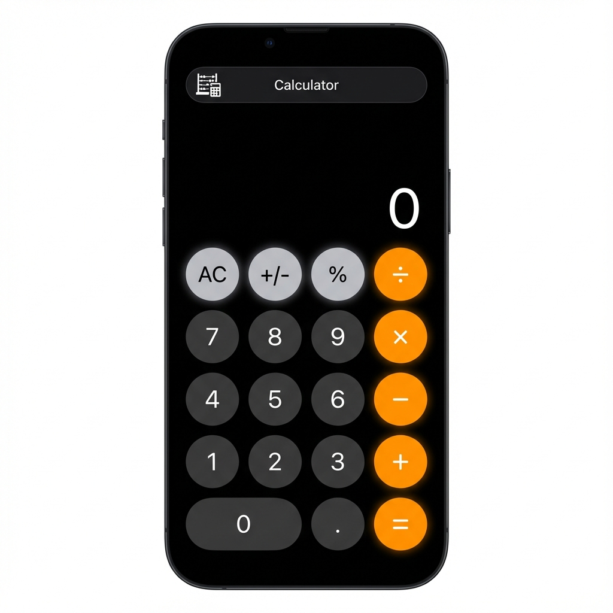

# iOS-Style Scientific Calculator

A modern, responsive scientific calculator web application inspired by the iOS calculator design. Built with Vanilla JavaScript, HTML, and CSS, utilizing Vite for development.

 *Note: Add a screenshot of your app here if available*

## 🌟 Features

- **Dual Modes:**
  - **Basic Mode:** Standard arithmetic operations (+, -, ×, ÷) in a clean, compact layout.
  - **Scientific Mode:** Expands to reveal advanced mathematical functions (trigonometry, logarithms, powers, roots, etc.).
- **Responsive Design:**
  - Adapts seamlessly to desktop and mobile screens.
  - Scientific keys are hidden by default and can be toggled via the navigation bar.
- **iOS Aesthetic:**
  - Sleek dark mode interface.
  - Rounded buttons and smooth transitions.
  - Dynamic font sizing for the display to fit long numbers.
- **Advanced Math Functions:**
  - Trigonometry: `sin`, `cos`, `tan`, `sinh`, `cosh`, `tanh` (supports Radians/Degrees).
  - Powers & Roots: `x²`, `x³`, `xʸ`, `√`, `∛`, `ʸ√x`.
  - Logarithms: `log` (base 10), `ln` (natural log).
  - Constants: `π` (Pi), `e` (Euler's number).
  - Others: Factorial (`x!`), Random number (`Rand`), Inverse (`1/x`).
- **Memory Functions:** `mc`, `m+`, `m-`, `mr`.

## 🛠️ Technologies Used

- **HTML5:** Semantic structure.
- **CSS3:** Grid layout, CSS variables, and responsive media queries.
- **JavaScript (ES6+):** Object-oriented logic for calculator operations.
- **Vite:** Fast frontend build tool and development server.

## 🚀 Getting Started

### Prerequisites

- Node.js installed on your machine.

### Installation

1.  **Clone the repository:**
    ```bash
    git clone https://github.com/nivas4506/Caluclator-IOS-style.git
    cd Caluclator-IOS-style
    ```

2.  **Install dependencies:**
    ```bash
    npm install
    ```

3.  **Run the development server:**
    ```bash
    npm run dev
    ```
    Open your browser and navigate to `http://localhost:5173` (or the port shown in your terminal).

## 📖 Usage

1.  **Basic Calculations:** Use the number pad and operator keys just like a standard calculator.
2.  **Scientific Mode:** Click the **🧮** icon in the top navigation bar to toggle the scientific keys.
3.  **Radians/Degrees:** In scientific mode, use the `Rad`/`Deg` button to switch the angle mode for trigonometric functions.

## 📂 Project Structure

```
├── index.html      # Main HTML file
├── main.js         # Calculator logic and DOM manipulation
├── style.css       # Styling and responsive layout
├── package.json    # Project dependencies and scripts
└── README.md       # Project documentation
```

## 🤝 Contributing

Contributions are welcome! Feel free to open issues or submit pull requests to improve the app.

## 📄 License

This project is open-source and available under the [MIT License](LICENSE).
